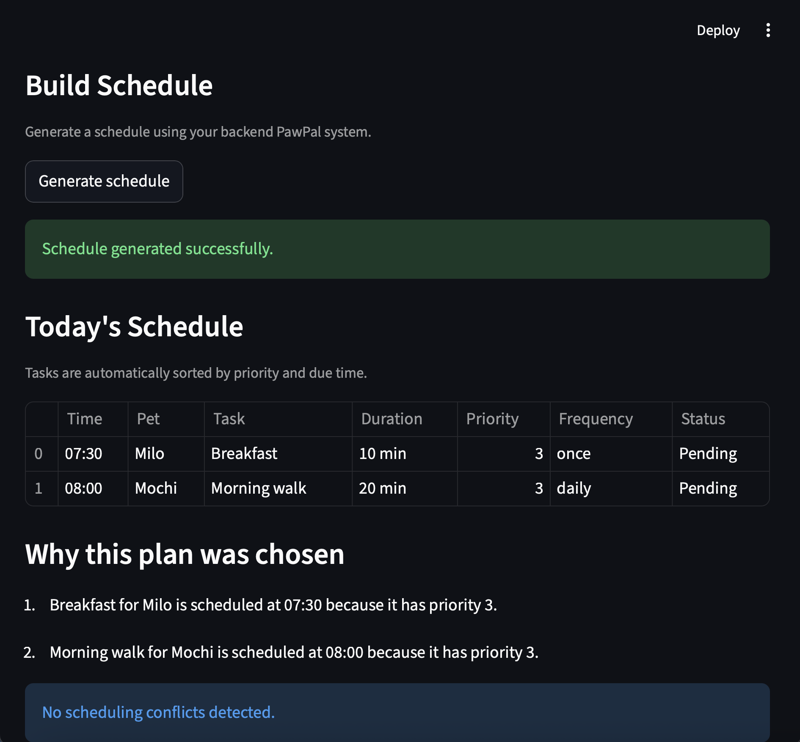

# PawPal+ — Smart Pet Care Scheduler

PawPal+ is a Streamlit-based pet care planning application that helps pet owners organize daily tasks such as feeding, walking, medication, grooming, and playtime.

The system combines object-oriented design, scheduling logic, persistent storage, and AI-inspired task suggestions to create a more useful and interactive pet care workflow.

## Live Demo

- **Deployed App:** https://ai110-module2show-pawpal-starter-2ixkannbu2sp793leowb6t.streamlit.app/
- **GitHub Repository:** https://github.com/minh1608/ai110-module2show-pawpal-starter

## 📸 Demo

Below is an example of the PawPal+ scheduling interface.



## Scenario

A busy pet owner needs help staying consistent with pet care. They want an assistant that can:

- Track pet care tasks (walks, feeding, meds, enrichment, grooming, etc.)
- Consider constraints (time available, priority, owner preferences)
- Produce a daily plan and explain why it chose that plan

## Features

PawPal+ includes several intelligent scheduling features designed to help pet owners manage daily care tasks effectively:

- **Multi-Pet Management**  
  Owners can manage multiple pets and assign tasks to each pet individually.

- **Task Sorting by Time**  
  Tasks can be sorted by due date and time to create a clear chronological schedule.

- **Priority-Based Planning**  
  Higher-priority tasks appear earlier in the generated daily plan.

- **Task Filtering**  
  Tasks can be filtered by pet name or completion status.

- **Recurring Tasks**  
  When a task with a frequency of `daily` or `weekly` is completed, the system automatically creates the next occurrence.

- **Conflict Detection**  
  The scheduler detects tasks scheduled at the same date and time and provides warning messages.

- **AI Task Suggestions**  
  The system recommends common tasks based on pet species. For example, dogs may receive suggestions such as **Morning Walk** or **Feed Breakfast**, while cats may receive suggestions such as **Clean Litter Box** or **Play Session**.

- **Data Persistence**  
  Owner, pet, and task data are saved in `data.json`, allowing the app to preserve information between runs.

## System Design

The application is built around four main classes:

- **Owner** — stores owner information and manages pets
- **Pet** — stores pet details and associated tasks
- **Task** — represents an individual care task with scheduling metadata
- **Scheduler** — handles sorting, filtering, recurrence, conflict detection, and schedule generation

The final UML diagram is included in the project as:

- `uml_final.png`

## Getting Started

### Setup

```bash
python -m venv .venv
source .venv/bin/activate  # Windows: .venv\Scripts\activate
pip install -r requirements.txt
```

### Run the App
```bash
python -m streamlit run app.py
```

## Testing PawPal+

Run the automated tests with:

```bash
python -m pytest
```

The current test suite verifies core behaviors in the PawPal+ system, including:
- task completion
- task addition
- chronological sorting
- recurring task creation
- conflict detection

**Confidence Level:** ★★★★☆ (4/5)

I am confident that the core scheduling logic works correctly for the main happy paths and key edge cases covered by the tests. If I had more time, I would add more tests for empty schedules, overlapping durations, and weekly recurrence edge cases.

## Project Files
- `app.py` — Streamlit user interface
- `pawpal_system.py` — backend logic and scheduling system
- `main.py` — CLI demo script for testing logic
- `reflection.md` — project reflection
- `uml_final.png` — final UML diagram
- `pawpal_demo.png` — UI screenshot
- `data.json` — persisted owner, pet, and task data